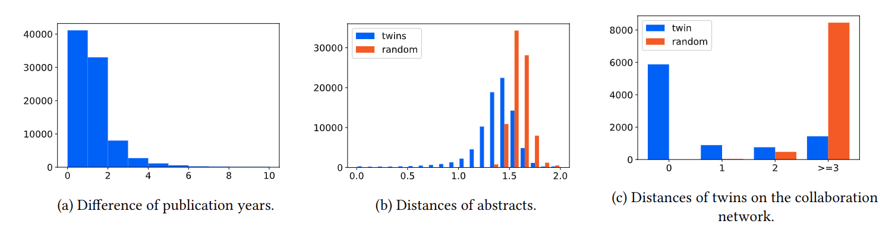

# Twin Papers: A Simple Framework of Causal Inference for Citations via Coupling (CIKM 2022)

We propose a simple framework for determining the best decision making in research processes. The basic idea is to regard a decision as an intervention and measure the outcome by the number of citations. However, it is difficult to test with actual interventions, e.g., by randomly changing publication venues or titles, because it may cause adverse impacts on the researchers' careers. In this paper, we are inspired by the existing counterfactual analysis using twins, where the researchers regard twins as counterfactual units, and we propose to regard a pair of papers that cite each other as twins.

Paper: https://arxiv.org/abs/2208.09862

## 💿 Dependency

```
$ pip install -r requirements.txt
$ sudo apt install wget unzip p7zip-full
```

## 🗃️ Download and Preprocess Datasets

You can download and preprocess data by the following command. It may take time and large memory.

```
$ bash download_and_preprocess.sh
```

Alternatively, you can download preprocessed data via

```
$ bash download_readymade.sh
```

* `twin_ids.pickle` lists twin papers.
* `twin_papers.pickle` stores various information of papers.
* `self.pickle` is a set of papers that are self-cited.
* `coauthor.pickle` is a collaboration network.

The definition of these files are described in `extract_twins.py`.

## 🧪 Experiments

### Confirming Assumptions (Section 5)



The image above can be reproduced by the following command.

```
$ python assumptions.py
```

### Analysis (Section 6)

|Treatment|$\|\mathcal{D}\|$|$\widetilde{\text{ATE}}$|
|----|----|----|
|Including a Colon in the Title|21080|0.356|
|Lengthening the Title|84970|-0.126|
|Lengthening the reference|81857|0.710|
|Lengthening the abstract|82917|0.248|
|Lengthening the paper|65730|0.630|
|Self citation|10582|1.30|
|Earlier publication|41546|−0.187|

The above table can be reproduced by `analyze.py`


|Treatment (a) | Control (b) | $\|\mathcal{D}^{a/b}\|$ | $\widetilde{\text{ATE}}$ |
|----|----|----|----|
Journal of Cognitive Neuroscience | NeuroImage | 817 | 0.539 |
IEEE Transactions on Information Theory | International Symposium on Information Theory | 459 | 1.93 |
Neural Computation | IEEE Transactions on Neural Networks | 216 | 0.632 |
Neural Computation | Neural Networks | 199 | 0.76 |
Symposium on the Theory of Computing | Foundations of Computer Science | 182 | 0.252 |
IEEE Transactions on Signal Processing | International Conference on Acoustics, Speech, and Signal Processing | 178 | 2.78 |
Neural Computation | Neurocomputing | 153 | 2.41 |
Journal of Economic Theory | Games and Economic Behavior | 125 | 0.668 |
IEEE ACM Transactions on Networking | International Conference on Computer Communications | 110 | 1.29 |
Symposium on the Theory of Computing | Symposium on Discrete Algorithms | 105 | 0.693 | 

The above table can be reproduced by `venue.py`

## 🖋️ Citation

```
@inproceedings{sato2022twin,
  author    = {Ryoma Sato, Makoto Yamada, Hisashi Kashima},
  title     = {Twin Papers: A Simple Framework of Causal Inference for Citations via Coupling},
  booktitle = {The 31st {ACM} International Conference on Information
               and Knowledge Management, {CIKM}},
  year      = {2022},
}
```
